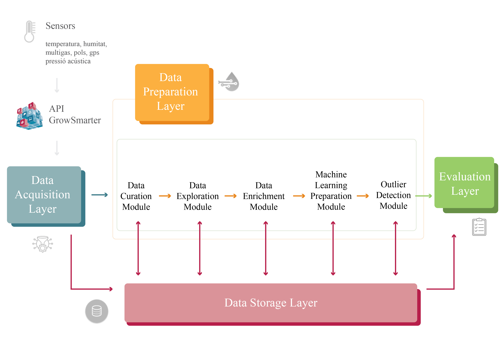

# GIVO
Garbage In, Valuable data Out (GIVO) has been developed by:

Marc Roig, Sergio Barrachina and Francisco Jose Wilhelmi

In collaboration with i2CAT Research Center.

The authors belong to the “Escola Superior Politécnica” of the
“Universitat Pompeu Fabra” https://www.upf.edu/web/etic
This code is part of Garbage In, Valuable data Out: automatic cleanig system for enviromental sensor data.

GIVO is under MIT license. You should have received a copy of the MIT License along with
GIVO. If not, see https://opensource.org/licenses/MIT

---------------------------------------------------------------

## DESCRIPTION

GIVO (Garbage In, Valuable data Out) is a entire system to enhance the quality of your data using unsupervised Machine Learning methods. Takes advantatge of three outlier detector methods (Isolation Forest, Elliptic Envelope and Local Outlier Factor) to create an unique Ensemble Outlier Detector to automatically detect wrong mesures in environmental sensors data. 

